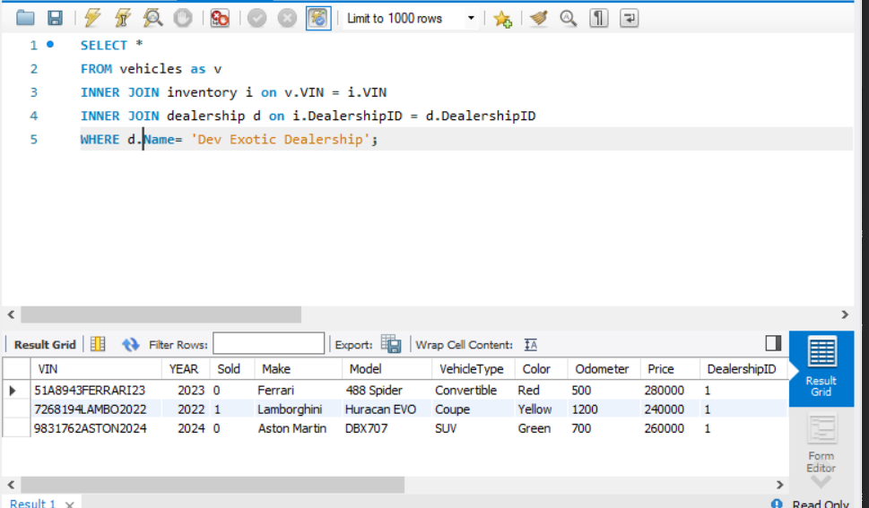

# Project Title
MySQL Dealership Queries
## Description of the Project

MySQL databases help store and manage data, making it easy for users to search and find the information they need. By running different queries, you can pull data from multiple tables and combine it to show the results in a simple and clear way. This makes it easier to understand and use the information.

## User Stories

- As the user I would like to be able to see all the information from dealerships.
- As the user I would like to be able to see all vehicles from a specific dealership.
- As the user I would like to be able to find a car by the VIN Number.
- As the user I would like to be able to find the dealership where a car is located bby the VIN number.
- As the user I would like to find the dealerships that have a certain make and model of car.
- As the user I would like to be displayed specific information for a dealership during a specific date range.

### Prerequisites

- IntelliJ IDEA: Ensure you have IntelliJ IDEA installed, which you can download from [here](https://www.jetbrains.com/idea/download/).
- Java SDK: Make sure Java SDK is installed and configured in IntelliJ.
- SQL Workbench

### Running the Application in IntelliJ

Follow these steps to get your application running within IntelliJ IDEA:

1. Open MySQL Workbench go to file
2. Click on Open MYSQL Script
3. Open Script and press lighting bolt.

## Technologies Used

- Java: Mention the version you are using.
- Any additional libraries or frameworks used in the project.
- MY SQL Workbench

## Demo

## Future Work

Outline potential future enhancements or functionalities you might consider adding:

- Making it compatible to Intellij

## Resources

## Team Members

- Brandon for the guidance through it.

## Thanks

Express gratitude towards those who provided help, guidance, or resources:

- Thank you to [Mentor's Name] for continuous support and guidance.
- A special thanks to all teammates for their dedication and teamwork.